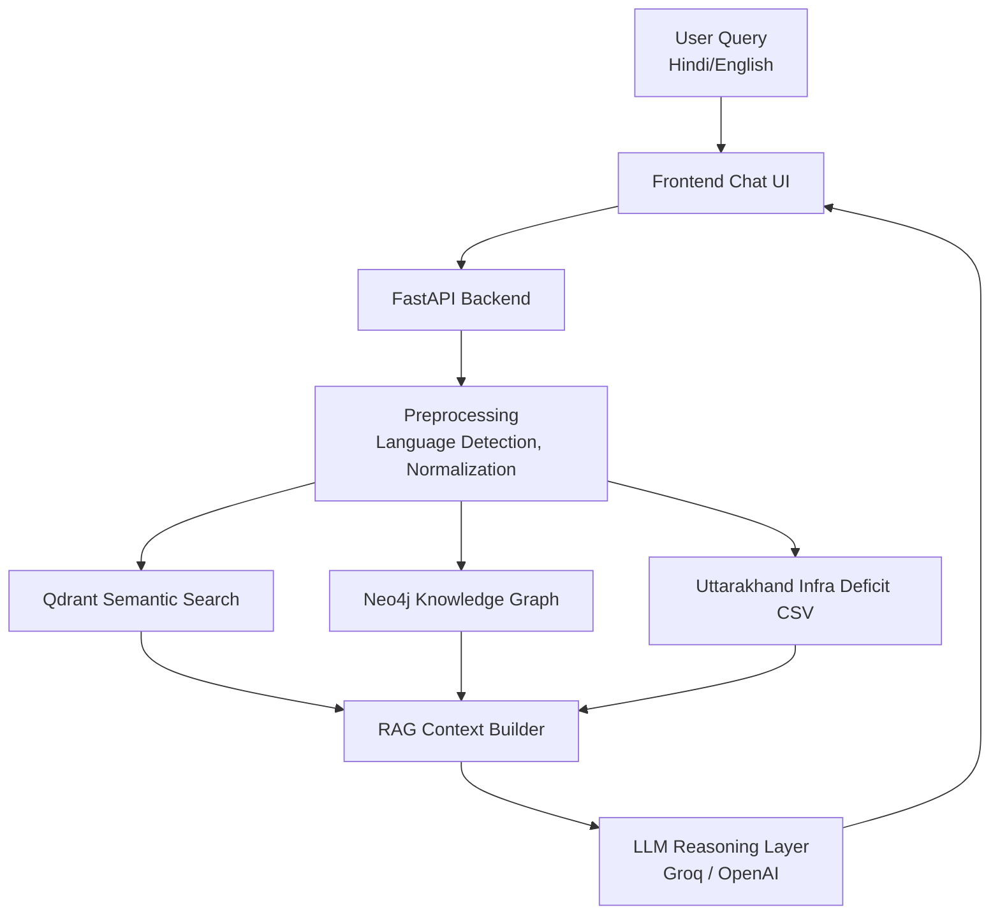

#  **Panchayat-Sahayika (AI-Powered Rural Governance Assistant)**

A multilingual (Hindi + English) AI assistant designed for rural development governance, enabling Gram Panchayats to access scheme information, analyze village deficits, retrieve government documents, and generate actionable development insights using **FastAPI**, **Qdrant Vector DB**, **Neo4j Knowledge Graph**, **LLMs**, and a modern **React + Tailwind** frontend.

**Demo Video:** [https://youtu.be/SvaaQusU9nU?si=S9WfEV2PBO07HTdO](https://youtu.be/SvaaQusU9nU?si=S9WfEV2PBO07HTdO)


---

# **Table of Contents**

1. [Overview](#overview)
2. [Features](#features)
3. [Folder Structure](#folder-structure)
4. [How to Run Locally](#how-to-run-locally)
5. [Architecture & Design Decisions](#architecture--design-decisions)
6. [Data Sources & Preprocessing](#data-sources--preprocessing)
7. [RAG + Knowledge Graph Pipeline](#rag--knowledge-graph-pipeline)
8. [LLM Reasoning Flow](#llm-reasoning-flow)
9. [Challenges & Trade-Offs](#challenges--trade-offs)

---

# **Overview**

Panchayat-Sahayika is an **AI-powered digital assistant** designed specifically for **rural governance in India**, helping Gram Panchayat officials, government workers, and citizens to:

* Understand development deficits
* Discover government schemes
* Ask questions about rural indicators
* Receive data-driven recommendations
* Access extended insights using RAG + LLM reasoning

The system integrates:

* **FastAPI backend**
* **Qdrant vector embeddings** for semantic search
* **LLMs (Groq / OpenAI)** for query interpretation
* **CSV datasets of Uttarakhand village-level deficits**
* **React + Tailwind frontend** for clean interaction

Real-world application:
We tested the prototype in **Pawo Malla village (Uttarakhand)** with the **Gram Pradhan**, gathering real on-ground feedback about water issues, connectivity problems, and village priorities.

---

# **Features**

### 🔹 **Multilingual Query Support**

Ask in Hindi or English → system automatically interprets meaning.

### 🔹 **Data-Driven Rural Insights**

System analyzes infrastructure deficits (roads, water, health, education).

### 🔹 **Government Scheme Retrieval**

Users can ask:

> “Hamare gaon ke liye paani yojana kaun si hai?”

### 🔹 **Qdrant-Powered Semantic Search**

Retrieves relevant paragraphs, government documents, schemes, and datasets.

### 🔹 **Knowledge Graph Reasoning**

Graph nodes:

* Development Themes
* Government Schemes
* Panchayat Needs
* Infrastructure deficits

Relationships enrich LLM outputs.

### 🔹 **Real-Time AI Responses**

LLM synthesizes scheme suggestions, cluster insights, and action strategies.

### 🔹 **Frontend With Clean UI**

Built with React + Tailwind for lightweight rural-friendly UX.

---

#  **Folder Structure**

```
Panchayat-Sahayika/
│
├── backend/
│   ├── data/                     # Scheme texts, rural indicators, reference docs
│   ├── qdrant_data/              # Preprocessed embeddings or vector payloads
│   ├── services/                 # RAG, embeddings, KG, query handlers
│   ├── utils/                    # Helper functions, preprocessors
│   ├── FinderScreen.py           # Infra deficit inference logic
│   ├── gram.py                   # Panchayat-specific retrieval logic
│   ├── app.py                    # FastAPI entry
│   ├── main.py                   # API routing + server startup
│   ├── requirements.txt
│   └── uttarakhand_infra_deficits.csv
│
├── public/
│
├── src/
│   ├── components/               # Chat UI, cards, loaders
│   ├── pages/                    # Main dashboard, chat page
│   ├── styles/                   # Tailwind configs
│   └── utils/                    # Frontend helpers
│
├── index.html
├── package.json
├── tailwind.config.js
└── README.md
```

---

#  **How to Run Locally**

---

## **1️⃣ Backend Setup**

### Install dependencies

```bash
cd backend
pip install -r requirements.txt
```

### Environment Variables

Create `.env`:

```
# --- Qdrant Vector DB ---
QDRANT_URL=your_qdrant_url
QDRANT_API_KEY=your_qdrant_key
EMBEDDING_MODEL=sentence-transformers/all-MiniLM-L6-v2

# --- LLM Keys ---
GROQ_API_KEY=your_groq_api
OPENAI_API_KEY=your_openai_api

# --- (Optional) Model Settings ---
MODEL_NAME=llama-3-8b
TEMPERATURE=0.2

```

### Run Backend

```bash
uvicorn main:app --reload
```

---

## **2️⃣ Frontend Setup**

```bash
cd frontend
npm install
npm run dev
```

Set `.env`:

```
VITE_API_URL=http://127.0.0.1:8000
```

App opens at:

```
http://localhost:5173
```

---

#  **Architecture & Design Decisions**

### ✔ **FastAPI**

Lightweight, modular, async-ready.

### ✔ **Qdrant Vector Search**

To store embeddings for:

* schemes
* documents
* development indicators

### ✔ **Neo4j Knowledge Graph**

Captures structured relationships between:

* Themes
* Schemes
* Infrastructure deficits
* Gram Panchayat needs

### ✔ **CSV Data Integration**

Uses `uttarakhand_infra_deficits.csv` to compute village-level gaps.

### ✔ **LLM Reasoning Layer**

Groq → Fast inference
OpenAI → fallback + improved quality

---

# 🔷 **Mermaid System Diagram**



---

#  **Data Sources & Preprocessing**

### **1. Rural Infrastructure Dataset**

File: `uttarakhand_infra_deficits.csv`
Contains metrics like:

* Water supply status
* Road access
* Healthcare centers
* Digital connectivity
* Education infrastructure

### **2. Government Schemes Dataset**

Stored in `/backend/data/`.

### **3. Preprocessing Steps**

* Text cleaning
* Stopword handling
* Semantic chunking
* Embedding generation
* KG node + edge creation

---

#  **RAG Pipeline**

### **1. Query Understanding**

* Detect language (Hindi/English)
* Identify keywords (water, roads, health)

### **2. Semantic Retrieval (Qdrant)**

Returns top N relevant chunks.

### **3. Infer Village-specific Deficits**

Via `FinderScreen.py`.

### **4. LLM Synthesis**

LLM merges:

* semantic context
* graph knowledge
* village deficit data

To generate a final actionable recommendation.

---

#  **LLM Reasoning Flow**

```text
User Query → Parse Intent → Retrieve Relevant Schemes → Fetch Village Deficits 
→ Expand using Knowledge Graph → LLM synthesis → Final Recommendation
```

Example:

> “Hamare gaon me paani ki dikkat hai. Kya sujhav hai?”

LLM Output includes:

* identified deficits from CSV
* related schemes like Jal Jeevan Mission
* local insights
* actionable steps

---

#  **Challenges & Trade-Offs**

### **1. Limited rural datasets available**

Solution: Hand-curated CSV for Uttarakhand.

### **2. Qdrant memory constraints**

Trade-off: Store compact MiniLM embeddings.

### **3. Neo4j sync delays**

Trade-off: Skip KG rebuild on every startup to save memory.

### **4. Hindi queries vary widely**

Trade-off: Simple rules + embeddings instead of a dedicated NLU model.

### **5. Edge cases in village names**

Solution: fuzzy matching + manual correction list.

---
